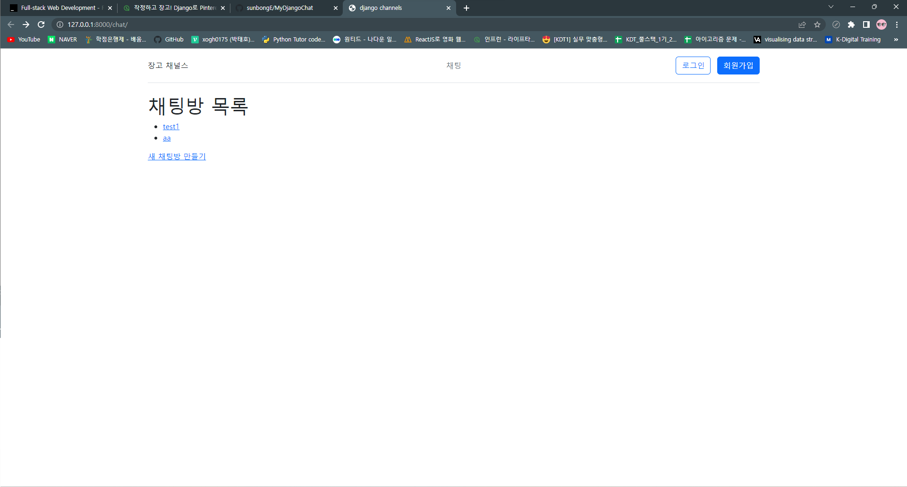
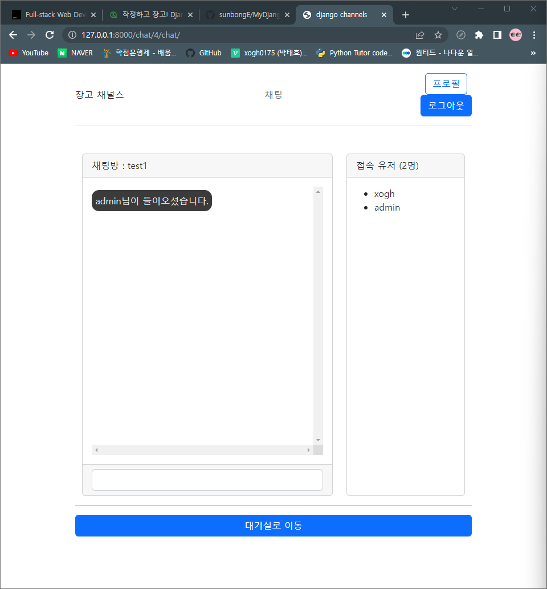
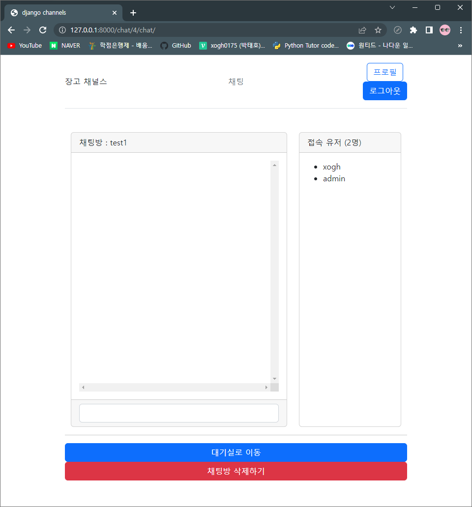
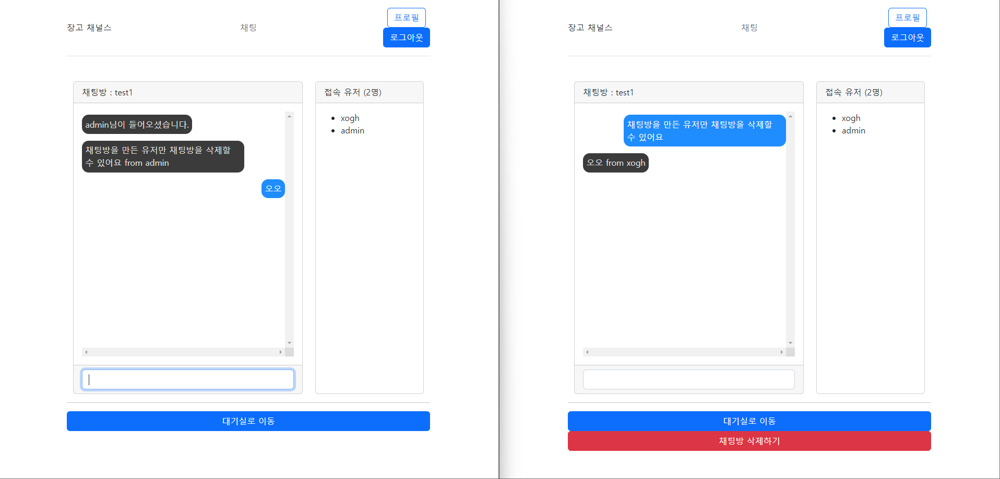
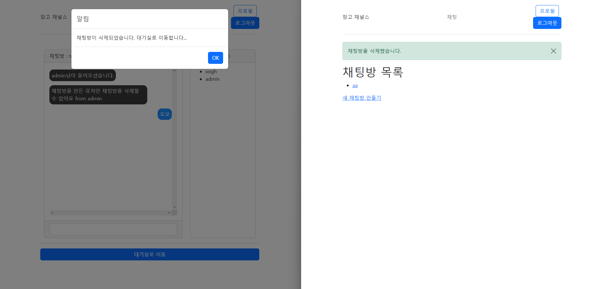

# Django-channels 사용 채팅 구현

개발 환경: 

- vscode
- Window

개발 언어:

- Python / Django
- Css/JS/HTML

[라이브러리](./사용되는_라이브러리.md)

# 홈

## 입장 및 접속 알림

유저1

---

유저2

## 채팅

## 채팅방 삭제

채팅방을 만든 유저가 채팅방을 삭제하면 
방에 있던 유저들에게 알리고 대기실로 이동한다.

---

 

회고

예전부터 구현하고 싶었던 실시간 채팅을 인프런강의를 통해 구현할 수 있어서 좋은 시간이었지만,
 너무 어려워서 반복 학습이 필요하다고 느낀다. 
다른 프로젝트를 통해 장고에 대해 조금 더 능숙해지고 이번 채팅기능을 다른 프로젝트에도 적용시킬 예정이다.

